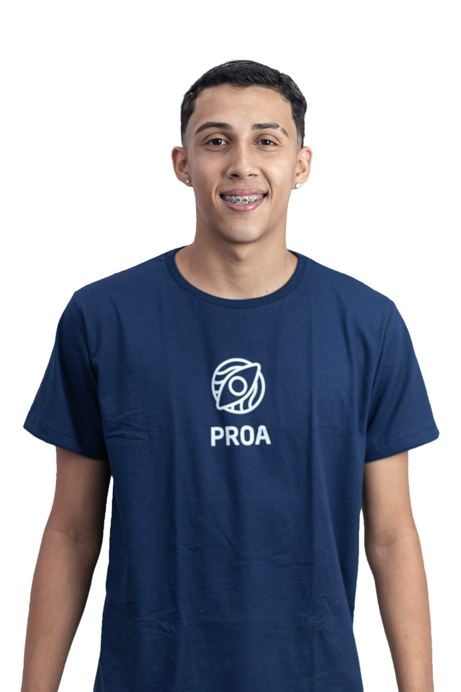
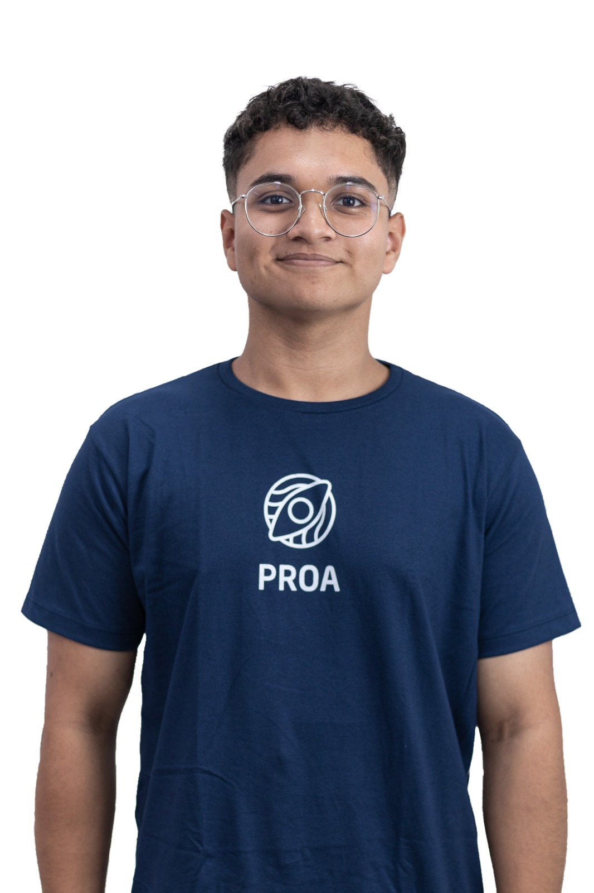
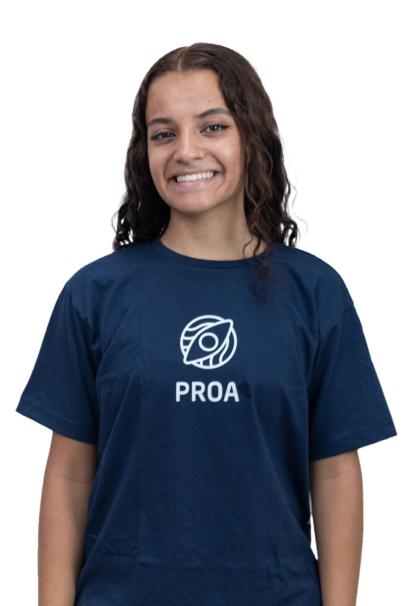
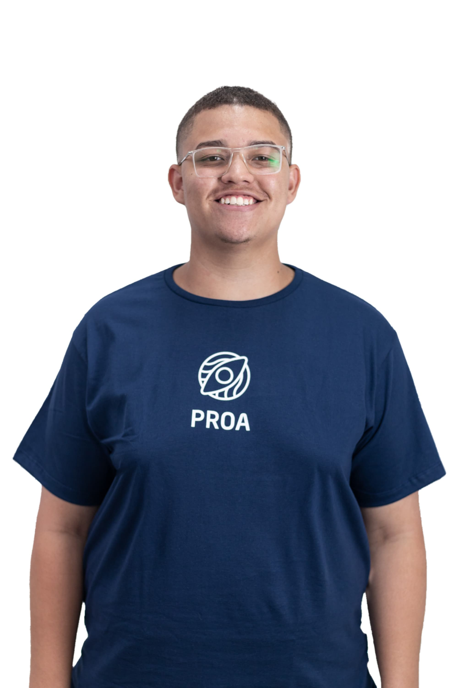
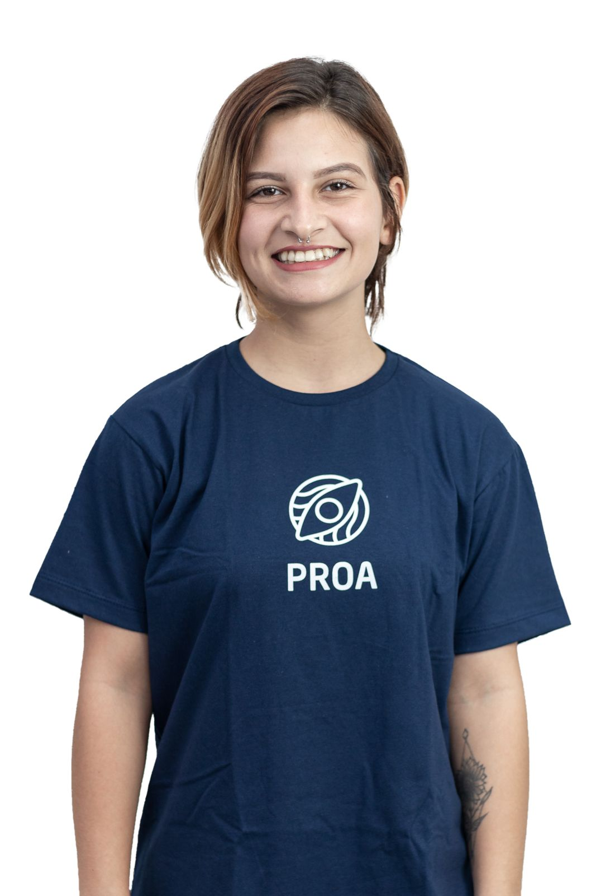

<h1 align=center>INCLUIDEV</h1>

  

#
### SOBRE NOS

Somos uma plataforma educacional contendo jogos, dinâmicas e cursos voltados para auxiliar no desenvolvimento de pessoas com deficiências que queiram ingressar no mercado tecnológico, equiparada com ferramentas didáticas e comunicação constante durante o processo lúdico. Com o objetivo de garantir que todas as pessoas tenham acesso igualitário a oportunidades, recursos e participação no mercado tecnológico, não somente incluindo, mas tornando-as pertencentes.

#
### EQUIPE

<table>
  <tr>
  <td align="center">
      <a href="https://github.com/kaiquesouzasantos" title="Github Kaique">
         
        
          <b>Kaique</b>
        
      </a>
    </td>
    </td>
    <td align="center">
      <a href="https://github.com/HenryModesto" title="Github Henry">
         
        
          <b>Henry</b>
        
      </a>
    </td>
    <td align="center">
      <a href="https://github.com/Kayk-Dev" title="Github Kayky">
         
        
          <b>Kayk</b>
        
      </a>
    </td>
    <td align="center">
      <a href="https://github.com/adriele7" title="Github Adriele">
         
        
          <b>Adriele</b>
        
      </a>
    </td>
    <td align="center">
      <a href="https://github.com/IgorOdSilva" title="Github Igor">
         
        
          <b>Igor</b>
        
      </a>
    </td>
    <td align="center">
      <a href="https://github.com/eulineaguiar" title="Github Aline">
         
        
          <b>Aline</b>
        
      </a>
    </td>
    <td align="center">
      <a href="https://github.com/leoduarte14" title="Github Leonardo">
         
        
          <b>Leonardo</b>
        
      </a>
    </td>
  </tr>
</table>

#
### MENTOR

#
### TECNOLOGIAS

&nbsp;
&nbsp;
&nbsp;
&nbsp;
&nbsp;
&nbsp;
&nbsp;
&nbsp;
&nbsp;
&nbsp;

#
### SITE

#
### REDES SOCIAIS

